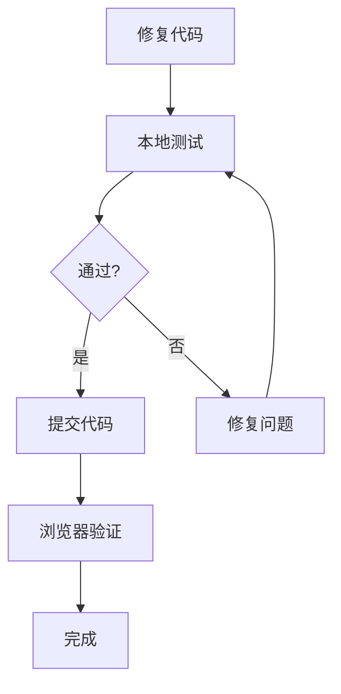

# 🎮 Game 开发项目规划

**项目**: 方块吞噬者 - Block Eater  
**日期**: 2026-02-12  
**目标**: 修复"点击开始无反应"问题，并持续开发

---

## 一、问题诊断

### 当前症状
- 点击"开始游戏"按钮无反应
- 无法进入游戏

### 可能原因

| # | 问题 | 概率 | 状态 |
|---|------|------|------|
| 1 | AudioContext 需要用户交互才能初始化 | 🔴 高 | 待修复 |
| 2 | JavaScript 语法错误 | 🟡 中 | 待检查 |
| 3 | 事件监听器未正确绑定 | 🟡 中 | 待检查 |
| 4 | 浏览器兼容性问题 | 🟢 低 | 待确认 |

---

## 二、修复计划

### 立即修复 (P0)

```bash
# 1. 备份原文件
cp index.html index.html.backup.$(date +%Y%m%d%H%M%S)

# 2. 修复 AudioContext 初始化
# 找到 startBtn 事件监听器
# 在点击时先调用 AudioSys.init()
```

### 验证步骤

```bash
# 1. 启动本地服务器
python3 -m http.server 8080

# 2. 浏览器打开
# http://localhost:8080

# 3. 检查控制台是否有错误
```

---

## 三、开发分工

### 使用 Skills

| # | Skill | 任务 | 负责人 |
|---|--------|------|--------|
| 1 | **github** | 代码版本管理 | Coder |
| 2 | **team-tasks** | 任务追踪 | 臻维斯 |
| 3 | **video-processor** | 游戏录屏 | 臻维斯 |
| 4 | **multi-agent-orchestrator** | 需求拆解 | 臻维斯 |

### 子代理分配

| # | Agent | 任务 |
|---|--------|------|
| 1 | Coder | 代码开发、Bug 修复 |
| 2 | Coder2 | 测试、代码审查 |

---

## 四、任务清单

### P0 - 紧急修复

- [ ] 1. 备份 index.html
- [ ] 2. 修复 AudioContext 初始化
- [ ] 3. 启动本地服务器测试
- [ ] 4. 验证问题是否解决

### P1 - 功能开发

- [ ] 1. 添加分数排行榜
- [ ] 2. 优化移动端触控
- [ ] 3. 添加音效开关
- [ ] 4. 添加暂停功能

### P2 - 体验优化

- [ ] 1. 添加新皮肤
- [ ] 2. 添加背景音乐
- [ ] 3. 添加成就系统
- [ ] 4. 添加每日挑战

---

## 五、测试流程



---

## 六、Git 工作流

```bash
# 创建分支
git checkout -b fix/button-not-working

# 修复问题
# ...

# 提交
git add index.html
git commit -m "fix: 修复 AudioContext 初始化问题"

# 推送到远程
git push origin fix/button-not-working
```

---

## 七、监控指标

| 指标 | 目标 | 当前 |
|------|------|------|
| 按钮点击响应率 | 100% | ❌ |
| 游戏帧率 | 60 FPS | 待测 |
| 加载时间 | < 2s | 待测 |

---

## 八、相关文件

- 游戏入口: `/home/KINGSTON/.openclaw/workspace/web-game-evolution/index.html`
- 备份目录: `/home/KINGSTON/.openclaw/workspace/web-game-evolution/*.backup.*`
- 开发脚本: `/home/KINGSTON/.openclaw/workspace/skills/team-tasks/game_dev.py`

---

*规划生成时间: 2026-02-12*
